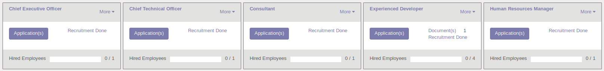
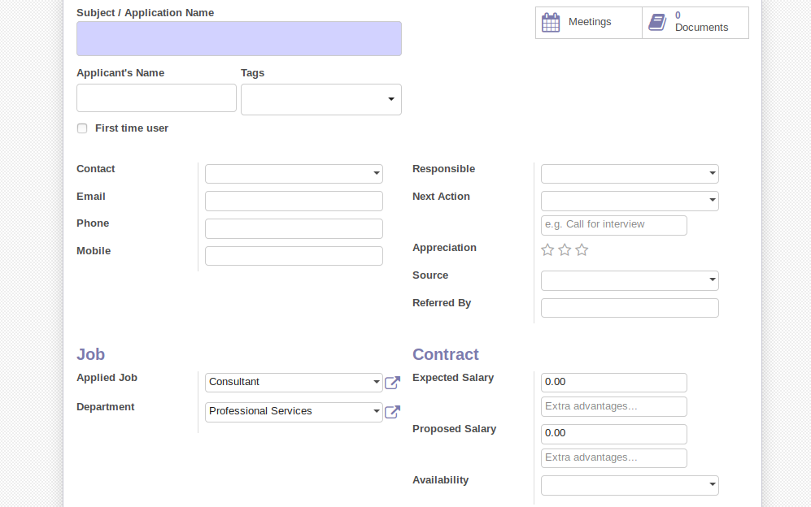
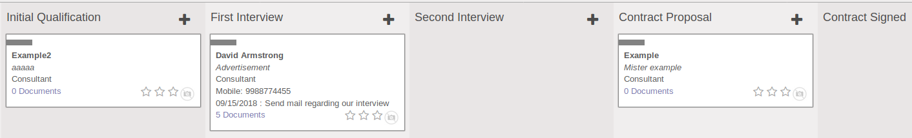
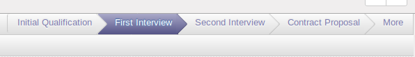
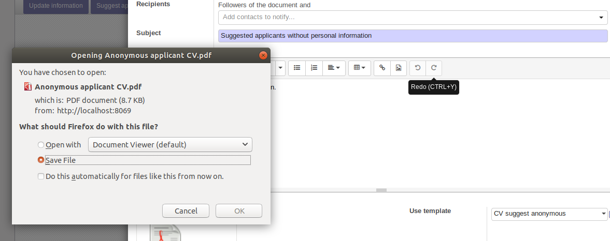

# Applicant Tracking System (ATS) for Odoo v.10.0

---

## Contents 

[Contents](#contents)  
[Module Data](#module-data)  
[Document History](#document-history) 
[Description](#description)  
[Installation](#instalation)  
[Working/usage](#working/usage)  
[Testing/Quality Assurance](#Testing/Quality Assurance)  

---
## Module Data

 

| **Module Name**  	| *applicant_tracking_system* |
|:---  |:--- || :---  |
| **Version**   | 1.0  |
|**Odoo Compatibility Version** |10.0|
|**Author**|Antonio Stoilov – m31@euroblaze.de|
|**Links** |http://www.euroblaze.de|
|**Depends** | base, hr_recruitment, mail, website |

 
---

## Document History

 

| **Date**  	|  *12.09.2018*   | 
| :---  | :---  |:--- |
| **Programmer**  | Ignat Petrov  |
| **Notes** |  Document created  |

---

## Description

1. Applicant Tracking System (ATS) is used for organizing the hiring proccess of an applicant. With the help of this module, the person/people who are responsible for expanding the company staff, can easily and visually have a track of the applicant's current status, weather he is about to have his first or second interview or he is about to sign a contract.

* This module has a very friendly user interface. The open job positions are displayed by 5 at each row. For every job position there is a header, a status-bar that shows the number of hired employes and every job position can display the application/s for it.

* For every job position, there are 5 stages, that applicants can be arranged into:
	- Initial Qualification
	- First Interview
	- Second Interview
	- Contract proposal
	- Contract signed

* The candidate has all the personal information, that is provided in his application (CV), manually entered in odoo by the responsible figure for this module. After successful first interview, for example, he can be manually transfered to the *second interview* stage, and the person working with this module will have a better representation of the applicants and their current stages in the hiring process.

* Sometimes one candidate can be more suitable for another company. That's why this module has a feature called "Suggest applicant" which automatically creates a CV of the candidate in PDF form and sends it by e-mail.

* PDF's of the candidates CV's can be generated. There is an option which includes anonymous CV for a certain applicant.

* The person that use this module, can easily update candidates information whenever it's needed. 

---
## Note:

1. Please give 777 permissions to the export folder. The permission can be given, by opening a new terminal in the export folder and executing the command:

>sudo chmod 777 export_name_folder

---

##Installation

1. Copy the *applicant_tracking_system* folder from the (we still dont know the path at which this module will be set up on modstore.io) to your current working copy of modules folder.

* In your working environment, go to Apps and enter the name of the module and press install.
* Give 777 permissions for the export folder, since the exported file is stored in that folder

---
## Working/usage

* The view of the opened job positions is user friendly, displaying 5 open positions per row.

* Firstly, candidate's information needs to be entered. 

* After creating a candidate applying for a certain job position, his stage is set as initial qualification. 

* The person responsible for tracking applicants can move the candidate to any other stage depending on his ability and his interview appearance. 

* One candidate can be suggested to another company. The CV is automatically generated in PDF form and it's view can be chosen from a couple of predefined templates. Suggesting an applicant is best used with sending an Anonymous CV, which has a couple of restrictions regarding the candidate's personal information.

The PDF's are saveable and printable. Applicant CV and Anonymous CV templates are customly created.  

* For the Applicant CV, the name and the surname of the candidate are displayed firstly. After that there are a couple of sections. The first section displays project experience. What follows next is the education section which is divided into high school, university and course. Next are the accomplishments and languages sections.

* The Anonymous CV's template also contains the previously mentioned sections. The main difference is that this form protects candidate's personal information, so the email, phone number and the mobile phone number are removed from the form. Candidate's first and last name are not displayed as before, it has the following form: Firstname LastName's first letter | candidate's ID (six digits). For example, if Antonio Stoilov (the author of this module) is created as an applicant, for a certain job position, and his CV is printed, his first and last name would be displayed as: Antonio S | 000007.

---
## Testing / Quality Assurance

This module has been tested with Odoo v.10.0 on simplify-erp's personal database.
Users wishing to obtain our test-results may email us at m41@euroblaze.de.

